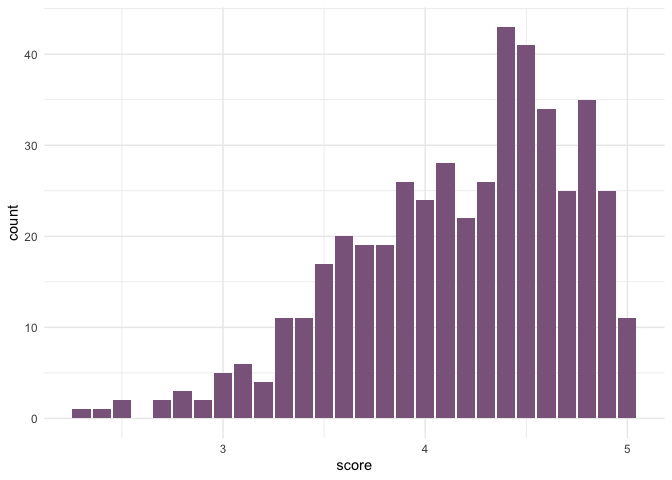
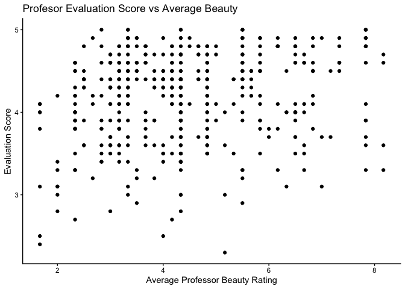
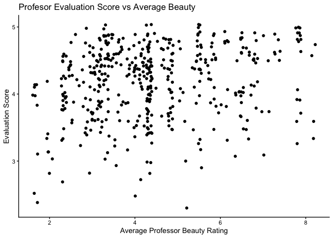
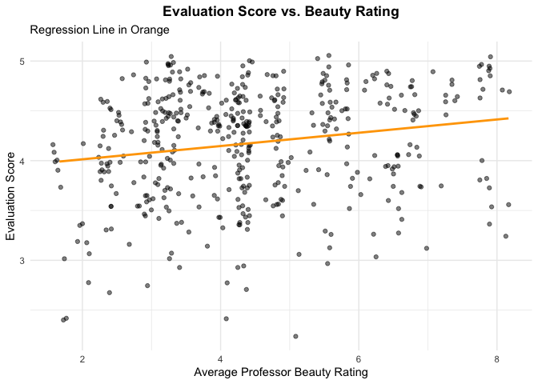

Lab 10 - Grading the professor
================
Anaelle Gackiere
03-27-2026

Here is a link to the [lab
instructions](https://datascience4psych.github.io/DataScience4Psych/lab10.html).

## Load Packages and Data

``` r
library(tidyverse) 
library(tidymodels)
library(openintro)
```

# Part 1

## Exercise 1

The distribution of scores is negatively skewed, so students are
relatively generous. The mean score is 4.175, and the minimum score
given was 2.3 (at least not a 0!).

``` r
# descriptives
summary(evals$score)
```

    ##    Min. 1st Qu.  Median    Mean 3rd Qu.    Max. 
    ##   2.300   3.800   4.300   4.175   4.600   5.000

``` r
# visualization
ggplot(evals, aes(x = score)) +
  geom_bar( fill = "plum4", bins = 30) +
  theme_minimal()
```

    ## Warning in geom_bar(fill = "plum4", bins = 30): Ignoring unknown parameters:
    ## `bins`

<!-- -->

## Exercise 2

I actually initially did geom_jitter, but doing geom_point is
problematic for discrete variables, and will result in a strange looking
scatterplot like this one below (see description at exercise 3). The
issue with geom_point here is that we are not (EXPLAIN).

``` r
ggplot(data = evals, aes(x = bty_avg, y = score)) +
  geom_point() +
  labs(title = "Profesor Evaluation Score vs Average Beauty",
       x = "Average Professor Beauty Rating",
       y = "Evaluation Score") +
  theme_classic() 
```

<!-- -->

## Exercise 3

``` r
ggplot(data = evals, aes(x = bty_avg, y = score)) +
  geom_jitter() +
  labs(title = "Profesor Evaluation Score vs Average Beauty",
       x = "Average Professor Beauty Rating",
       y = "Evaluation Score") +
  theme_classic() 
```

<!-- -->

We have a few outliers of low scores with low attractiveness, but
overall most of the points are high regardless of beauty level. After
closer inspection, there might be a somewhat positive trend between
beauty and score, but it’s unclear to what extent and whether or not
it’s linear.

# Part 2

### Exercise 4

The fitted model is: **y = 3.88 + 0.0666 × bty_avg** For every one-point
increase in average beauty rating, the model predicts evaluation score
increases by about 0.07 points. For exampple, if a professor goes from a
beauty rating of 4 to a 5, their predicted evaluation score goes up by
0.07.

``` r
# model
m_bty <- lm(score ~ bty_avg, data = evals)

# view output
m_bty
```

    ## 
    ## Call:
    ## lm(formula = score ~ bty_avg, data = evals)
    ## 
    ## Coefficients:
    ## (Intercept)      bty_avg  
    ##     3.88034      0.06664

``` r
# effect check
glance(m_bty)
```

    ## # A tibble: 1 × 12
    ##   r.squared adj.r.squared sigma statistic   p.value    df logLik   AIC   BIC
    ##       <dbl>         <dbl> <dbl>     <dbl>     <dbl> <dbl>  <dbl> <dbl> <dbl>
    ## 1    0.0350        0.0329 0.535      16.7 0.0000508     1  -366.  738.  751.
    ## # ℹ 3 more variables: deviance <dbl>, df.residual <int>, nobs <int>

### Exercise 5

``` r
ggplot(evals, aes(x = bty_avg, y = score)) +
  geom_jitter(width = 0.1, height = 0.1, color = "black", alpha = 0.5) +
  geom_smooth(method = "lm", color = "orange", se = FALSE) +
  labs(
    title = "Evaluation Score vs. Beauty Rating",
    subtitle = "Regression Line in Orange",
    x = "Average Professor Beauty Rating",
    y = "Evaluation Score"
  ) +
  theme_minimal() +
  theme(
    plot.title = element_text(hjust = 0.5, face = "bold")
  )
```

    ## `geom_smooth()` using formula = 'y ~ x'

<!-- -->

### Exercise 6

As mentioned before, for every one-point increase in average beauty
rating, the model predicts evaluation score increases by about 0.07
points; thus, as beauty ratings increase, so do evaluation scores. The
intercept is not meaningful here since there is no true 0. This is a
statistically detectable but practically trivial effect, since beauty
explains only 3.5% of the variation in scores (R² = 0.035), meaning the
vast majority of what drives evaluation scores has nothing to do with
looks. Right now, it seems that beauty is a minor piece of the story.
The issue with the shading here is it can make a trivial relationship
look like a big deal just because it takes up visual space.

# Part 3

### Exercise 7

The reference level is “Female”; R can’t put “female” and “male” into a
math equation directly, so it turns one into 0 and the other into 1.
Female = 0 (the baseline), male = 1. The two coefficients are the
Intercept = 4.09, which is the predicted score for female professors
(the reference level) and gendermale = 0.14. Male professors score 0.14
points higher than female professors on average

Predicted mean evaluation score for each gender:

Female: 4.09 + 0.14(0) = 4.09

Male: 4.09 + 0.14(1) = 4.23

``` r
m_gen <- lm(score ~ gender, data = evals)
tidy(m_gen)
```

    ## # A tibble: 2 × 5
    ##   term        estimate std.error statistic p.value
    ##   <chr>          <dbl>     <dbl>     <dbl>   <dbl>
    ## 1 (Intercept)    4.09     0.0387    106.   0      
    ## 2 gendermale     0.142    0.0508      2.78 0.00558

### Exercise 8

``` r
# new variables

evals <- evals %>%
  mutate(
    rank_relevel = relevel(factor(rank), ref = "tenure track"),
    tenure_eligible = ifelse(rank == "teaching", "no", "yes")
  )

# Model 1, og rank variable 
m_rank <- lm(score ~ rank, data = evals)

# Model 2, rank with tenure track as reference
m_rank_relevel <- lm(score ~ rank_relevel, data = evals)

# Model 3, tenure eligible variable
m_tenure_eligible <- lm(score ~ tenure_eligible, data = evals)

tidy(m_rank)
```

    ## # A tibble: 3 × 5
    ##   term             estimate std.error statistic   p.value
    ##   <chr>               <dbl>     <dbl>     <dbl>     <dbl>
    ## 1 (Intercept)         4.28     0.0537     79.9  1.02e-271
    ## 2 ranktenure track   -0.130    0.0748     -1.73 8.37e-  2
    ## 3 ranktenured        -0.145    0.0636     -2.28 2.28e-  2

``` r
tidy(m_rank_relevel)
```

    ## # A tibble: 3 × 5
    ##   term                 estimate std.error statistic   p.value
    ##   <chr>                   <dbl>     <dbl>     <dbl>     <dbl>
    ## 1 (Intercept)            4.15      0.0521    79.7   2.58e-271
    ## 2 rank_relevelteaching   0.130     0.0748     1.73  8.37e-  2
    ## 3 rank_releveltenured   -0.0155    0.0623    -0.249 8.04e-  1

``` r
tidy(m_tenure_eligible)
```

    ## # A tibble: 2 × 5
    ##   term               estimate std.error statistic   p.value
    ##   <chr>                 <dbl>     <dbl>     <dbl>     <dbl>
    ## 1 (Intercept)           4.28     0.0536     79.9  2.72e-272
    ## 2 tenure_eligibleyes   -0.141    0.0607     -2.32 2.10e-  2

``` r
glance(m_rank)
```

    ## # A tibble: 1 × 12
    ##   r.squared adj.r.squared sigma statistic p.value    df logLik   AIC   BIC
    ##       <dbl>         <dbl> <dbl>     <dbl>   <dbl> <dbl>  <dbl> <dbl> <dbl>
    ## 1    0.0116       0.00733 0.542      2.71  0.0679     2  -372.  752.  768.
    ## # ℹ 3 more variables: deviance <dbl>, df.residual <int>, nobs <int>

``` r
glance(m_rank_relevel)
```

    ## # A tibble: 1 × 12
    ##   r.squared adj.r.squared sigma statistic p.value    df logLik   AIC   BIC
    ##       <dbl>         <dbl> <dbl>     <dbl>   <dbl> <dbl>  <dbl> <dbl> <dbl>
    ## 1    0.0116       0.00733 0.542      2.71  0.0679     2  -372.  752.  768.
    ## # ℹ 3 more variables: deviance <dbl>, df.residual <int>, nobs <int>

``` r
glance(m_tenure_eligible)
```

    ## # A tibble: 1 × 12
    ##   r.squared adj.r.squared sigma statistic p.value    df logLik   AIC   BIC
    ##       <dbl>         <dbl> <dbl>     <dbl>   <dbl> <dbl>  <dbl> <dbl> <dbl>
    ## 1    0.0115       0.00935 0.541      5.36  0.0210     1  -372.  750.  762.
    ## # ℹ 3 more variables: deviance <dbl>, df.residual <int>, nobs <int>

### Exercise 9

Model 1 uses teaching as the reference level, giving an intercept of
4.28, meaning teaching faculty have a predicted evaluation score of
4.28. Tenure track faculty score 0.13 points lower (4.15) and tenured
faculty score 0.15 points lower (4.13) than teaching faculty. Model 2
switches the reference to tenure track, giving an intercept of 4.15.
Teaching faculty score 0.13 points higher (4.28) than tenure track,
while tenured faculty score essentially the same as tenure track, only
0.015 points lower (4.14). Model 3 collapses tenure track and tenured
into one “yes” group, with teaching as the reference at 4.28. Tenure
eligible faculty score 0.14 points lower (4.14) than teaching faculty.
Overall, teaching faculty score slightly higher than tenure track and
tenured faculty, but the differences are small.

### Exercise 10

R-squared for Model 1: 0.01 (p = 0.068)

R-squared for Model 2: 0.01 (p = 0.068)

R-squared for Model 3: 0.01 (p \< 0.05)

Based on the R-squared of 0.01, rank explains only 1% of the variation
in evaluation scores. Even though the third model’s R-squared is
statistically significant, that does not mean much, practically
speaking.

# Part 4

Is the “beauty effect” still there once we account for gender?

``` r
# beauty only
m_bty <- lm(score ~ bty_avg, data = evals)
tidy(m_bty)
```

    ## # A tibble: 2 × 5
    ##   term        estimate std.error statistic   p.value
    ##   <chr>          <dbl>     <dbl>     <dbl>     <dbl>
    ## 1 (Intercept)   3.88      0.0761     51.0  1.56e-191
    ## 2 bty_avg       0.0666    0.0163      4.09 5.08e-  5

``` r
glance(m_bty)
```

    ## # A tibble: 1 × 12
    ##   r.squared adj.r.squared sigma statistic   p.value    df logLik   AIC   BIC
    ##       <dbl>         <dbl> <dbl>     <dbl>     <dbl> <dbl>  <dbl> <dbl> <dbl>
    ## 1    0.0350        0.0329 0.535      16.7 0.0000508     1  -366.  738.  751.
    ## # ℹ 3 more variables: deviance <dbl>, df.residual <int>, nobs <int>

``` r
# beauty + gender 
m_bty_gen <- lm(score ~ bty_avg + gender, data = evals)
tidy(m_bty_gen)
```

    ## # A tibble: 3 × 5
    ##   term        estimate std.error statistic   p.value
    ##   <chr>          <dbl>     <dbl>     <dbl>     <dbl>
    ## 1 (Intercept)   3.75      0.0847     44.3  6.23e-168
    ## 2 bty_avg       0.0742    0.0163      4.56 6.48e-  6
    ## 3 gendermale    0.172     0.0502      3.43 6.52e-  4

``` r
glance(m_bty_gen)
```

    ## # A tibble: 1 × 12
    ##   r.squared adj.r.squared sigma statistic     p.value    df logLik   AIC   BIC
    ##       <dbl>         <dbl> <dbl>     <dbl>       <dbl> <dbl>  <dbl> <dbl> <dbl>
    ## 1    0.0591        0.0550 0.529      14.5 0.000000818     2  -360.  729.  745.
    ## # ℹ 3 more variables: deviance <dbl>, df.residual <int>, nobs <int>

### Exercise 11

When gender is added, the beauty slope increases slightly from 0.067 to
0.074.

### Exercise 12

For two professors with the same beauty rating, since the gender
coefficient is 0.17, the male professor is still predicted to score 0.17
points higher.

### Exercise 13

Adjusted R-squared for Beauty only Model: 0.033

Adjusted R-squared for Beauty and Gender Model: 0.055

Beauty is doing most of the work. Adding gender helps a little, since it
bumps the adjusted r-squared from 0.033 to 0.055, but that’s only a 2
percentage point improvement. Both models are still weak overall and
neither beauty nor gender explains evaluation scores in a meaningful
way.

### Exercise 14

``` r
m_bty_rank <- lm(score ~ bty_avg + rank, data = evals)
tidy(m_bty_rank)
```

    ## # A tibble: 4 × 5
    ##   term             estimate std.error statistic   p.value
    ##   <chr>               <dbl>     <dbl>     <dbl>     <dbl>
    ## 1 (Intercept)        3.98      0.0908     43.9  2.92e-166
    ## 2 bty_avg            0.0678    0.0165      4.10 4.92e-  5
    ## 3 ranktenure track  -0.161     0.0740     -2.17 3.03e-  2
    ## 4 ranktenured       -0.126     0.0627     -2.01 4.45e-  2

``` r
glance(m_bty_rank)
```

    ## # A tibble: 1 × 12
    ##   r.squared adj.r.squared sigma statistic   p.value    df logLik   AIC   BIC
    ##       <dbl>         <dbl> <dbl>     <dbl>     <dbl> <dbl>  <dbl> <dbl> <dbl>
    ## 1    0.0465        0.0403 0.533      7.46 0.0000688     3  -363.  737.  758.
    ## # ℹ 3 more variables: deviance <dbl>, df.residual <int>, nobs <int>

The intercept is 3.98, which is the predicted score for teaching faculty
with a beauty rating of 0. The beauty slope is 0.068, meaning for every
one point increase in beauty rating, evaluation scores increase by 0.068
points regardless of rank. Even after controlling for rank, beauty still
has an effect.

For rank, tenure track professors score 0.16 points lower than teaching
faculty and tenured professors score 0.13 points lower than teaching
faculty, holding beauty constant. Teaching faculty are still the
highest.

# Part 5

### Exercise 15

On its own, I would expect `cls_profs` (number of professors teaching a
section) to be the worst predictor of evaluation scores. I don’t really
see a reason why whether a course is taught by one professor or multiple
professors would affect how students rate an individual professor’s
teaching.

### Exercise 16

As I expected, the adjusted R-squared for cls_profs is only -.002. The
coefficient for is -0.029, so for courses taught by a single professor
score 0.029 points lower than multi-professor courses. The p-value is
0.58, so we can confirm that this is a useless predictor.

``` r
m_cls_profs <- lm(score ~ cls_profs, data = evals)
tidy(m_cls_profs)
```

    ## # A tibble: 2 × 5
    ##   term            estimate std.error statistic p.value
    ##   <chr>              <dbl>     <dbl>     <dbl>   <dbl>
    ## 1 (Intercept)       4.18      0.0311   134.      0    
    ## 2 cls_profssingle  -0.0292    0.0534    -0.547   0.585

``` r
glance(m_cls_profs)
```

    ## # A tibble: 1 × 12
    ##   r.squared adj.r.squared sigma statistic p.value    df logLik   AIC   BIC
    ##       <dbl>         <dbl> <dbl>     <dbl>   <dbl> <dbl>  <dbl> <dbl> <dbl>
    ## 1  0.000649      -0.00152 0.544     0.299   0.585     1  -374.  755.  767.
    ## # ℹ 3 more variables: deviance <dbl>, df.residual <int>, nobs <int>

### Exercise 17

We should not include `cls_did_eval` as an additional predictor because
it’s probably derived from `cls_perc_eval` and `cls_students`. The
number of students who completed evaluations is just the percentage
times the total students, so including all three would be redundant (and
leads to multicolinearity).

### Exercise 18

``` r
m_full <- lm(score ~ rank + ethnicity + gender + language + age + cls_perc_eval + 
               cls_students + cls_level + cls_credits + bty_avg, 
             data = evals)
tidy(m_full)
```

    ## # A tibble: 12 × 5
    ##    term                   estimate std.error statistic  p.value
    ##    <chr>                     <dbl>     <dbl>     <dbl>    <dbl>
    ##  1 (Intercept)            3.53      0.240       14.7   3.54e-40
    ##  2 ranktenure track      -0.107     0.0819      -1.31  1.91e- 1
    ##  3 ranktenured           -0.0454    0.0651      -0.697 4.86e- 1
    ##  4 ethnicitynot minority  0.189     0.0761       2.49  1.32e- 2
    ##  5 gendermale             0.178     0.0514       3.47  5.78e- 4
    ##  6 languagenon-english   -0.127     0.108       -1.17  2.41e- 1
    ##  7 age                   -0.00666   0.00308     -2.16  3.10e- 2
    ##  8 cls_perc_eval          0.00568   0.00154      3.68  2.65e- 4
    ##  9 cls_students           0.000449  0.000357     1.26  2.09e- 1
    ## 10 cls_levelupper         0.0184    0.0555       0.331 7.41e- 1
    ## 11 cls_creditsone credit  0.511     0.116        4.40  1.36e- 5
    ## 12 bty_avg                0.0611    0.0166       3.67  2.67e- 4

``` r
glance(m_full)
```

    ## # A tibble: 1 × 12
    ##   r.squared adj.r.squared sigma statistic  p.value    df logLik   AIC   BIC
    ##       <dbl>         <dbl> <dbl>     <dbl>    <dbl> <dbl>  <dbl> <dbl> <dbl>
    ## 1     0.163         0.143 0.503      8.01 8.30e-13    11  -333.  692.  746.
    ## # ℹ 3 more variables: deviance <dbl>, df.residual <int>, nobs <int>

### Exercise 19

Using backward-selection with adjusted R-squared as the selection
criterion, the best model is m4: Y = 3.45 + 0.20(ethnicity) +
0.18(gender) - 0.16(language) - 0.005(age) + 0.005(cls_perc_eval) +
0.52(cls_credits) + 0.065(bty_avg).

``` r
# remove cls_students
m2 <- lm(score ~ rank + ethnicity + gender + language + age + cls_perc_eval + 
           cls_level + cls_credits + bty_avg, data = evals)
glance(m2)
```

    ## # A tibble: 1 × 12
    ##   r.squared adj.r.squared sigma statistic  p.value    df logLik   AIC   BIC
    ##       <dbl>         <dbl> <dbl>     <dbl>    <dbl> <dbl>  <dbl> <dbl> <dbl>
    ## 1     0.161         0.142 0.504      8.64 5.53e-13    10  -334.  692.  742.
    ## # ℹ 3 more variables: deviance <dbl>, df.residual <int>, nobs <int>

``` r
# remove cls_level
m3 <- lm(score ~ rank + ethnicity + gender + language + age + cls_perc_eval + 
           cls_credits + bty_avg, data = evals)
glance(m3)
```

    ## # A tibble: 1 × 12
    ##   r.squared adj.r.squared sigma statistic  p.value    df logLik   AIC   BIC
    ##       <dbl>         <dbl> <dbl>     <dbl>    <dbl> <dbl>  <dbl> <dbl> <dbl>
    ## 1     0.161         0.144 0.503      9.63 1.71e-13     9  -334.  690.  735.
    ## # ℹ 3 more variables: deviance <dbl>, df.residual <int>, nobs <int>

``` r
# remove rank and this is the final model
m4 <- lm(score ~ ethnicity + gender + language + age + cls_perc_eval + 
           cls_credits + bty_avg, data = evals)
glance(m4)
```

    ## # A tibble: 1 × 12
    ##   r.squared adj.r.squared sigma statistic  p.value    df logLik   AIC   BIC
    ##       <dbl>         <dbl> <dbl>     <dbl>    <dbl> <dbl>  <dbl> <dbl> <dbl>
    ## 1     0.158         0.145 0.503      12.2 2.88e-14     7  -335.  688.  725.
    ## # ℹ 3 more variables: deviance <dbl>, df.residual <int>, nobs <int>

``` r
tidy(m4)
```

    ## # A tibble: 8 × 5
    ##   term                  estimate std.error statistic  p.value
    ##   <chr>                    <dbl>     <dbl>     <dbl>    <dbl>
    ## 1 (Intercept)            3.45      0.203       17.0  2.26e-50
    ## 2 ethnicitynot minority  0.205     0.0747       2.74 6.38e- 3
    ## 3 gendermale             0.185     0.0499       3.70 2.38e- 4
    ## 4 languagenon-english   -0.161     0.103       -1.56 1.18e- 1
    ## 5 age                   -0.00501   0.00261     -1.92 5.53e- 2
    ## 6 cls_perc_eval          0.00509   0.00144      3.54 4.36e- 4
    ## 7 cls_creditsone credit  0.515     0.105        4.91 1.26e- 6
    ## 8 bty_avg                0.0650    0.0163       3.98 7.99e- 5

### Exercise 20

Numerical predictor (AGE): For every one year increase in age,
evaluation scores decrease by 0.005 points, holding all other variables
constant.

Categorical predictor (ETHNICITY): Professors who are not a minority
score 0.20 points higher than minority professors, holding all other
variables constant.

### Exercise 21

Based on the model, the highest predicted evaluation score would come
from a professor who is male, not a minority, teaches in English, is
younger, more attractive, and teaches a one credit course with a high
percentage of students completing evaluations.

### Exercise 22

I would be hesitant to generalize my conclusions to professors at any
university, as students and professors are nested in the university, so
I would want to run an MLM to test this across multiple universities,
and then we may be able to generalize more confidently to the general
university population. Even within the school, the sample may not be
representative of all departments or course types, which adds another
layer of caution before generalizing anywhere.
